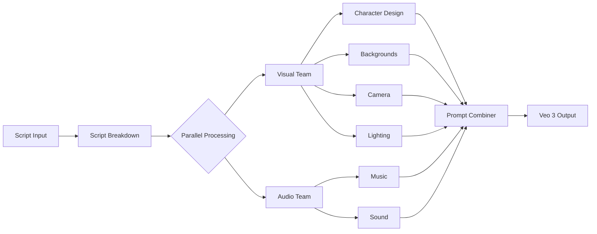

# 🎬 Film Crew AI - Script-to-Veo3 Production System

<div align="center">


**Transform screenplays into cinematic AI prompts with a swarm of specialized film production agents** 🎥✨

[Features](#-features) • [Quick Start](#-quick-start) • [Agents](#-meet-the-crew) • [Workflows](#-workflows) • [Examples](#-examples) • [Contributing](#-contributing)

</div>

---

## 🌟 What is Film Crew AI?

Film Crew AI orchestrates a **swarm of 8 specialized AI agents** that analyze scripts through the lens of experienced filmmakers. Each agent is an expert in their craft - from cinematography to sound design - working together to create rich, cinematic prompts for **Google Veo 3** and other AI video generation tools.

### 🎯 The Problem It Solves

Converting scripts to AI video prompts typically results in:
- ❌ Literal, flat descriptions
- ❌ Missing emotional depth
- ❌ No audio design consideration
- ❌ Inconsistent visual style
- ❌ Lost dramatic structure

### ✨ The Film Crew AI Solution

- ✅ **Cinematic Analysis**: Understands dramatic peaks, emotional arcs, and visual poetry
- ✅ **Multi-Layered Prompts**: Camera, lighting, sound, and music in every shot
- ✅ **Genre Calibration**: Adapts style to match your genre (drama, comedy, thriller, etc.)
- ✅ **Strategic Silence**: Knows when NOT to use music for maximum impact
- ✅ **Off-Screen Storytelling**: Sound design that expands beyond the frame
- ✅ **Version Control**: Create restore points and iterate without losing work

---

## 🚀 Features

### 🤖 Intelligent Agent Swarm
- **8 Specialized Film Agents** working in parallel
- **64+ SPARC Sub-Agents** for enhanced processing
- **Swarm Intelligence** for coordinated analysis
- **Real-time Collaboration** between agents

### 🎨 Comprehensive Output
- **Veo 3 Prompts**: Ready-to-use video generation prompts
- **Music Cues**: Timing, instrumentation, and dynamics
- **Sound Design**: 3D soundscapes with perspective
- **Continuity Tracking**: Character and scene consistency

### 🔧 Advanced Capabilities
- **Batch Processing**: Handle multiple scripts automatically
- **Interactive Editing**: Modify specific shots while maintaining consistency
- **Version Control**: Restore points for every change
- **Web UI**: Monitor progress at `http://localhost:3000/console`

---

## 💫 Quick Start

### 📋 Prerequisites

```bash
# Required Software
✅ Node.js 16+ (https://nodejs.org/)
✅ Git (https://git-scm.com/)
✅ 8GB RAM minimum
```

### 📦 Installation

```bash
# 1. Clone the repository
git clone https://github.com/yourusername/film-crew-ai.git
cd film-crew-ai

# 2. Run the installer (Windows)
install-film-crew.bat

# 3. Verify installation
verify-installation.bat
```

<details>
<summary>📝 Manual Installation (macOS/Linux)</summary>

```bash
# Install dependencies
npm install -g @anthropic-ai/claude-code
npm install -g claude-flow@latest

# Initialize Claude Flow
npx claude-flow@latest init --sparc

# Copy agents to .claude folder
cp templates/agents/*.md .claude/agents/
cp templates/commands/*.md .claude/commands/

# Create test script
mkdir -p scripts
echo "FADE IN:\n\nINT. COFFEE SHOP - DAY\n\nSARAH enters.\n\nFADE OUT." > scripts/test-scene.txt
```

</details>

### 🎬 Your First Script Processing

1. **Add your script** to the `scripts/` folder:
```
scripts/
└── my-screenplay.txt
```

2. **Run the processor**:
```bash
process-scripts.bat
```

3. **Find your outputs** in timestamped folders:
```
output/
└── my-screenplay_2025-08-05_14-30/
    ├── veo3_prompts.json      # Ready for Veo 3!
    ├── music_cues.json        # Musical timing
    ├── sound_design.json      # Audio layers
    └── continuity.json        # Consistency tracking
```

---

## 🎭 Meet the Crew

Each agent brings Hollywood expertise to your script analysis:

### 🎬 **Script Breakdown** (`script-breakdown`)
*The Script Supervisor who sees beyond logistics*
- 📊 Identifies three-act structure and dramatic peaks
- 🎯 Maps emotional throughlines
- ⏱️ Calculates realistic shot durations
- 🎨 Finds opportunities for visual poetry

### 👥 **Character Analysis** (`character-analysis`)
*The Character Designer ensuring visual consistency*
- 🎨 Creates style cards (front/left/right/back views)
- 😊😢😡 Emotion cards calibrated to genre
- 👔 Wardrobe progression tracking
- 🎭 Micro-expressions and mannerisms

### 🏛️ **Background Designer** (`background-designer`)
*The Production Designer who makes environments tell stories*
- 🌍 World-building with authentic period details
- 📚 Environmental storytelling through props
- 🌤️ Weather as emotional expression
- 🎨 Visual layers (foreground/midground/background)

### 📹 **Camera Director** (`camera-director`)
*The Cinematographer creating purposeful visual poetry*
- 📐 Every angle serves story or emotion
- 🎥 Movement with meaning (dolly, track, handheld)
- 👁️ Visual metaphors and poetic close-ups
- 🔄 Alternative shots considered and rejected

### 💡 **Lighting Designer** (`lighting-designer`)
*The Gaffer shaping mood through illumination*
- 🌓 High/low contrast for genre tone
- 🎨 Color temperature for emotional state
- 👁️ Visual hierarchy through brightness
- 🕯️ Practical lights grounding reality

### 🎵 **Music Director** (`music-director`)
*The Composer who knows when silence speaks louder*
- 🤫 Strategic silence for maximum impact
- 🎼 Themes that evolve with character arcs
- 🎭 Genre-appropriate instrumentation
- 📈 Dynamic journey from pp to ff

### 🔊 **Sound Designer** (`sound-designer`)
*The Sound Artist sculpting invisible worlds*
- 🌍 Off-screen storytelling expanding the frame
- 🎧 3D soundscapes with perspective
- 🔇 Silence architecture (vacuum/selective/anticipatory)
- 👂 Subjective vs. objective sound

### 🎯 **Prompt Combiner** (`prompt-combiner`)
*The Post-Production Supervisor synthesizing everything*
- 🔄 Integrates all agent outputs
- ✅ Necessity testing for every element
- 📝 Creates comprehensive Veo 3 prompts
- 📊 Maintains continuity across shots

---

## 🔄 Workflows

### 🎬 **Main Production Workflow**



### ✏️ **Edit Mode Workflow**

Interactive editing for specific shots:

```bash
edit-mode.bat

Options:
1. Edit single shot     # Modify one aspect
2. Edit multiple shots  # Batch changes
3. Create restore point # Save current state
4. List versions       # View all saves
5. Restore version     # Rollback changes
```

### 🔄 **Version Control Workflow**

Every change is protected:
- 🔄 **Auto-restore points** before processing
- 💾 **Manual saves** during editing
- ↩️ **Instant rollback** to any version
- 📋 **Version history** tracking

---

## 📁 Project Structure

```
film-crew-ai/
├── 📜 Scripts and Configs
│   ├── install-film-crew.bat      # One-click installer
│   ├── process-scripts.bat        # Batch processor
│   ├── edit-mode.bat             # Interactive editor
│   ├── verify-installation.bat   # System checker
│   └── setup-github.bat          # GitHub integration
│
├── 🤖 AI Agents
│   ├── .claude/
│   │   ├── agents/              # Active agent files
│   │   ├── commands/            # Workflow commands
│   │   ├── memory/              # Persistent memory
│   │   └── versions/            # Restore points
│   │
│   └── templates/
│       ├── agents/              # Agent templates
│       └── commands/            # Command templates
│
├── 📝 Input/Output
│   ├── scripts/                 # Your screenplays here
│   ├── output/
│   │   ├── prompts/            # Veo 3 prompts
│   │   ├── music/              # Music cues
│   │   ├── sound/              # Sound design
│   │   └── continuity/         # Tracking docs
│   │
│   └── logs/                   # System logs
│
└── ⚙️ Configuration
    └── config/
        └── project-settings.json # Customize genres, style
```

---

## 🎮 Examples

### Example 1: Simple Scene

**Input Script:**
```screenplay
FADE IN:

INT. COFFEE SHOP - DAY

SARAH (30s, tired) enters, spots JOHN at a corner table.

SARAH
We need to talk about what happened.

FADE OUT.
```

**Output (Veo 3 Prompt):**
```json
{
  "shot_id": "1-1",
  "veo3_prompt": "[CAMERA] Slow dolly in from wide establishing shot to medium two-shot, slight handheld for intimacy... [SUBJECT] Sarah, exhausted, dark circles under eyes, enters bustling coffee shop, scanning anxiously before locking eyes with John... [ENVIRONMENT] Warm afternoon light through windows, steam from espresso machine, busy patrons oblivious to tension... [LIGHTING] High contrast with bright window backlighting Sarah's silhouette, warm practicals on John... [MUSIC] Silence except diegetic coffee shop ambience... [SOUND] Door chime, espresso hiss, muffled conversations, Sarah's sharp intake of breath...",
  "necessity_verdict": "essential",
  "continuity_notes": "Sarah's exhaustion must persist"
}
```

### Example 2: Action Sequence

<details>
<summary>View Action Scene Example</summary>

**Input:**
```screenplay
EXT. ROOFTOP - NIGHT

Chase sequence. HERO leaps between buildings.
```

**Output:**
```json
{
  "shot_id": "5-3",
  "veo3_prompt": "[CAMERA] Kinetic tracking shot following hero's leap, crash zoom on landing, Dutch tilt for disorientation... [LIGHTING] Harsh moonlight, flickering neon from signs below, police searchlights sweeping... [MUSIC] Driving percussion, 140 BPM, building to silence at apex of jump... [SOUND] Footsteps on gravel, distant sirens, wind rush during leap, heavy breathing..."
}
```

</details>

---

## 🛠️ Configuration

### Customize Your Production Style

Edit `config/project-settings.json`:

```json
{
  "genre": "Drama",              // Drama/Comedy/Thriller/Horror
  "tone": "Cinematic",          // Cinematic/Light/Dark/Realistic
  "visual_style": "High contrast, moody",
  "poetry_preferences": {
    "level": "high",           // high/medium/low
    "literal_vs_lyrical": "30/70"  // Balance percentage
  },
  "audio_philosophy": {
    "silence_usage": "strategic",
    "music_presence": "selective",
    "off_screen_emphasis": true
  }
}
```

---

## 🔧 Troubleshooting

<details>
<summary>📌 Common Issues & Solutions</summary>

### "Claude CLI not found"
```bash
npm install -g @anthropic-ai/claude-code
claude --version
```

### "No agents installed"
```bash
# Re-run installer
install-film-crew.bat

# Or manually copy
cp templates/agents/*.md .claude/agents/
```

### "Processing stuck"
1. Check UI: `http://localhost:3000/console`
2. Stop with `Ctrl+C`
3. Check logs: `logs/claude-flow.log`
4. Restart: `claude-flow start --ui`

### "Version conflict"
```bash
# Update to latest
npm update -g claude-flow@latest
npm update -g @anthropic-ai/claude-code
```

</details>

---

## 🤝 Contributing

We welcome contributions! See [CONTRIBUTING.md](CONTRIBUTING.md) for guidelines.

### Ways to Contribute:
- 🤖 **New Agents**: Create specialized film production agents
- 🎨 **Genres**: Add genre-specific processing templates
- 🌍 **Translations**: Help internationalize the project
- 📚 **Documentation**: Improve guides and examples
- 🐛 **Bug Reports**: Help us identify issues

---

## 📚 Documentation

- 📖 [Full Documentation](docs/README.md)
- 🤖 [Agent Development Guide](docs/AGENTS.md)
- 🔄 [Workflow Creation](docs/WORKFLOWS.md)
- 🎬 [Film Production Best Practices](docs/FILM-PRODUCTION.md)
- 🔌 [API Reference](docs/API.md)

---

## 📜 License

MIT License - see [LICENSE](LICENSE) file for details.

---

## 🙏 Acknowledgments

- 🎭 **Claude Flow** by [@ruvnet](https://github.com/ruvnet) for the orchestration framework
- 🤖 **Anthropic** for Claude and the Claude Code CLI
- 🎬 **Film Community** for production expertise and feedback
- ✨ **Contributors** who help improve this project

---

## 🚀 Roadmap

- [ ] 🎥 Support for more video AI platforms (Runway, Pika, etc.)
- [ ] 🌐 Web interface for script upload
- [ ] 📱 Mobile app for on-set adjustments
- [ ] 🤝 Collaborative editing features
- [ ] 🎨 Storyboard generation
- [ ] 🎵 AI music generation integration
- [ ] 🌍 Multi-language support

---

<div align="center">

**Built with ❤️ for filmmakers embracing AI**

[Report Bug](https://github.com/yourusername/film-crew-ai/issues) • [Request Feature](https://github.com/yourusername/film-crew-ai/issues) • [Join Discord](https://discord.gg/filmcrewai)

</div>