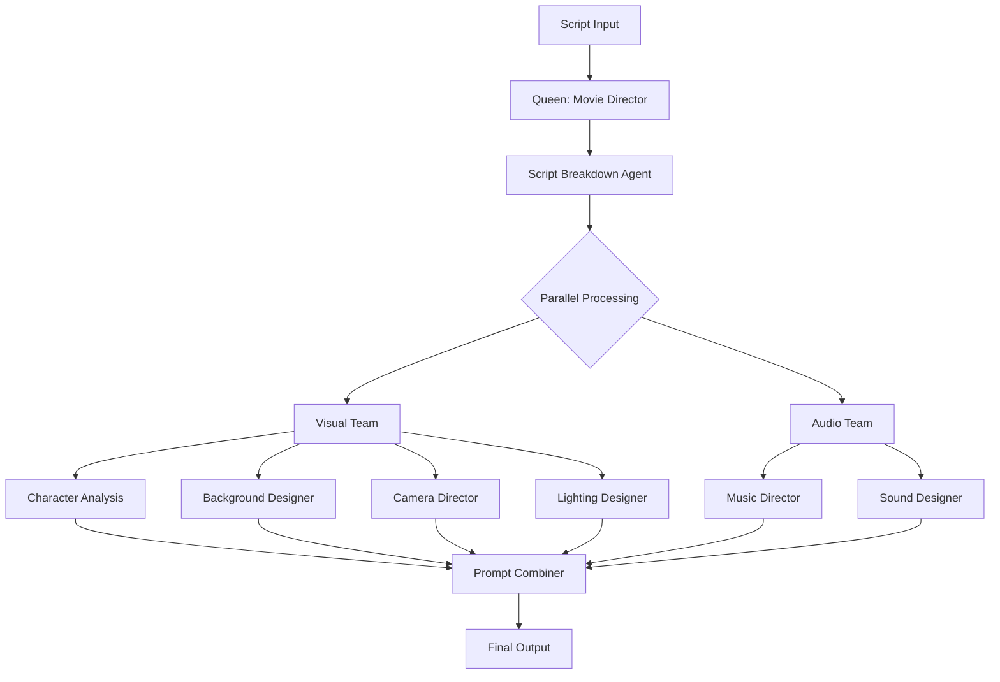

# 🤖 Film Crew AI - Agent Documentation

> Repository: https://github.com/kanibus/film-crew-ai

## 📚 Table of Contents
- [Overview](#overview)
- [How Agents Work](#how-agents-work)
- [Agent Specifications](#agent-specifications)
- [Creating Custom Agents](#creating-custom-agents)
- [Agent Communication](#agent-communication)

## 🎯 Overview

Film Crew AI uses a swarm of specialized agents that mirror a real film production crew. Each agent has deep expertise in their domain and works collaboratively to transform scripts into comprehensive video generation prompts.

## 🔄 How Agents Work

### The Swarm Architecture



### Processing Phases

1. **Analysis Phase** - Script breakdown identifies structure and needs
2. **Parallel Phase** - Visual and audio teams work simultaneously
3. **Synthesis Phase** - Prompt combiner integrates all outputs
4. **Validation Phase** - Necessity testing and continuity checks

## 📋 Agent Specifications

### 🎬 Script Breakdown Agent

**Purpose**: Analyzes dramatic structure and creates shot list foundation

**Key Capabilities**:
- Three-act structure identification
- Emotional arc mapping
- Shot duration estimation
- Visual opportunity detection

**Input**: Raw screenplay text
**Output**: Structured JSON with scenes, shots, and timing

**Example Output**:
```json
{
  "analysis": {
    "genre": "Drama",
    "tone": "Intimate",
    "dramatic_peak": {
      "scene": 3,
      "moment": "Confession",
      "visual_weight": "Close-up intensity"
    }
  },
  "scenes": [{
    "scene_number": 1,
    "location": "INT. COFFEE SHOP - DAY",
    "emotional_arc": "tension → recognition → dread",
    "shots": [...]
  }]
}
```

### 👥 Character Analysis Agent

**Purpose**: Ensures visual consistency and emotional authenticity

**Key Capabilities**:
- Style card generation (4 views)
- Emotion calibration by genre
- Wardrobe tracking
- Micro-expression documentation

**Unique Features**:
- Genre-aware emotion scaling
- Continuity tracking across scenes
- Character evolution mapping

### 🏛️ Background Designer Agent

**Purpose**: Creates environments that tell stories

**Philosophy**: "Every prop has a purpose, every detail reveals character"

**Key Capabilities**:
- Period-authentic details
- Environmental storytelling
- Weather as emotion
- Layered visual depth

**Output Layers**:
1. Foreground - Immediate action space
2. Midground - Supporting context
3. Background - World atmosphere
4. Kinetic - Movement and life

### 📹 Camera Director Agent

**Purpose**: Crafts purposeful visual language

**Camera Philosophy**:
- No random angles
- Movement must have meaning
- Poetry over coverage
- Consider alternatives

**Shot Decision Matrix**:
| Angle | Emotional Impact | Use Case |
|-------|-----------------|----------|
| Low | Power, heroism | Dominance moments |
| High | Vulnerability | Judgment scenes |
| Dutch | Unease | Psychological tension |
| Wide | Isolation | Environmental context |

### 💡 Lighting Designer Agent

**Purpose**: Shapes mood through illumination

**Lighting Strategies**:
- **Drama**: Motivated, naturalistic
- **Thriller**: Sharp shadows, unstable
- **Comedy**: Bright, even, welcoming
- **Horror**: Darkness dominates

**Technical Approach**:
```json
{
  "key_light": "45° angle, soft",
  "fill_ratio": "3:1 for drama",
  "practicals": ["window", "lamp"],
  "color_temp": "3200K warm"
}
```

### 🎵 Music Director Agent

**Purpose**: Strategic musical architecture

**Core Principle**: "Silence is the most powerful instrument"

**Music Decision Tree**:
1. Does this moment need music?
2. If yes, what emotion to support?
3. If no, what type of silence?
4. How long to hold?

**Silence Types**:
- **Vacuum**: Complete removal
- **Selective**: One element isolated
- **Anticipatory**: Before impact
- **Tinnitus**: After loudness

### 🔊 Sound Designer Agent

**Purpose**: Sculpts invisible narrative layers

**Sound Philosophy**:
- Off-screen expands the world
- Perspective shapes experience
- Layers create depth
- Silence has architecture

**Layer Structure**:
```
Immediate (character-caused)
├── Environmental (consistent presence)
├── Distant (horizon sounds)
└── Psychological (subjective distortion)
```

### 🎯 Prompt Combiner Agent

**Purpose**: Synthesizes all outputs into cohesive prompts

**Necessity Testing**:
1. **Essential Test**: Does removing it break the story?
2. **Elevation Test**: Does it transcend literal description?
3. **Poetry Test**: Is it lyrical over literal?
4. **Distinction Test**: Is it different from previous shots?

## 🛠️ Creating Custom Agents

### Agent Template Structure

```markdown
---
name: agent-name-here
description: Clear purpose statement. Use PROACTIVELY when [specific trigger].
---

You are a [Role] with expertise in [Domain].

## Core Philosophy:
[2-3 sentences about approach]

## Processing Method:

1. **Phase One: Analysis**
   - What to examine
   - Key considerations
   - Quality metrics

2. **Phase Two: Creation**
   - Generation approach
   - Integration points
   - Output standards

## Output Format:
{
  "analysis": {},
  "recommendations": [],
  "technical_specs": {}
}
```

### Best Practices

1. **Single Responsibility**: Each agent should excel at one thing
2. **Clear Output**: Always provide structured JSON
3. **Integration Ready**: Consider how output feeds other agents
4. **Genre Aware**: Adapt approach based on film genre
5. **Necessity Focused**: Every output must earn its inclusion

### Example: Creating a Color Grading Agent

```markdown
---
name: color-grading
description: Color palette specialist creating mood through chromatic choices. Use PROACTIVELY for visual tone setting.
---

You are a Color Grading Specialist who shapes emotional response through color.

## Color Philosophy:
Color is subconscious emotion. Cool isolation, warm comfort, desaturated despair.

## Analysis Process:

1. **Scene Mood Mapping**
   - Emotional temperature
   - Saturation as energy
   - Contrast as conflict

2. **Palette Creation**
   - Primary mood color
   - Accent highlights
   - Shadow tones

## Output Format:
{
  "shot_id": "X-Y",
  "color_grade": {
    "primary_palette": ["#hex1", "#hex2"],
    "temperature": "3200K-6500K",
    "saturation": "percentage",
    "contrast_curve": "S-curve/linear"
  }
}
```

## 🔄 Agent Communication

### Message Passing Protocol

Agents communicate through structured JSON messages:

```json
{
  "from": "camera-director",
  "to": "lighting-designer",
  "shot_id": "2-3",
  "message_type": "requirement",
  "content": {
    "camera_angle": "low",
    "needs": "dramatic key light from below"
  }
}
```

### Synchronization Points

1. **After Script Breakdown** - All agents receive scene structure
2. **During Parallel Processing** - Visual/audio teams coordinate
3. **Before Synthesis** - Final alignment check
4. **Post Validation** - Continuity verification

### Conflict Resolution

When agents disagree:
1. Prompt Combiner acts as arbiter
2. Story necessity takes precedence
3. Genre conventions guide decisions
4. User settings break ties

## 📊 Performance Metrics

### Agent Efficiency Tracking

| Agent | Avg Process Time | Token Usage | Quality Score |
|-------|-----------------|-------------|---------------|
| Script Breakdown | 15s | 2,000 | 95% |
| Character Analysis | 8s | 1,500 | 92% |
| Background Designer | 10s | 1,800 | 94% |
| Camera Director | 7s | 1,200 | 96% |
| Lighting Designer | 5s | 800 | 93% |
| Music Director | 6s | 1,000 | 97% |
| Sound Designer | 7s | 1,100 | 95% |
| Prompt Combiner | 12s | 2,500 | 98% |

### Optimization Tips

1. **Batch Processing**: Process multiple scenes simultaneously
2. **Cache Reuse**: Store character/location data
3. **Parallel Execution**: Run visual/audio teams concurrently
4. **Smart Pruning**: Skip unnecessary regeneration

## 🚀 Advanced Features

### Dynamic Agent Spawning

For large projects, spawn additional agents:

```bash
claude-flow agent spawn character-analysis --name "CharacterBot2"
claude-flow agent spawn background-designer --name "LocationBot2"
```

### Agent Specialization

Train agents for specific genres:

```bash
claude-flow agent specialize horror-lighting --base lighting-designer
claude-flow agent specialize comedy-timing --base camera-director
```

### Custom Workflows

Create genre-specific workflows:

```json
{
  "workflow": "horror-production",
  "agents": [
    "script-breakdown",
    "horror-atmosphere",
    "tension-camera",
    "shadow-lighting",
    "silence-sound",
    "minimal-music"
  ]
}
```

## 🔍 Debugging Agents

### Common Issues

1. **Output Mismatch**: Check JSON structure
2. **Slow Processing**: Reduce parallel agents
3. **Memory Issues**: Clear cache between runs
4. **Integration Failures**: Verify message format

### Debug Commands

```bash
# Test single agent
claude-flow agent test script-breakdown --input test-scene.txt

# View agent logs
claude-flow agent logs camera-director --verbose

# Check agent health
claude-flow agent health --all
```

## 📚 Further Reading

- [Workflow Documentation](WORKFLOWS.md)
- [Film Production Best Practices](FILM-PRODUCTION.md)
- [API Reference](API.md)
- [Performance Tuning](PERFORMANCE.md)